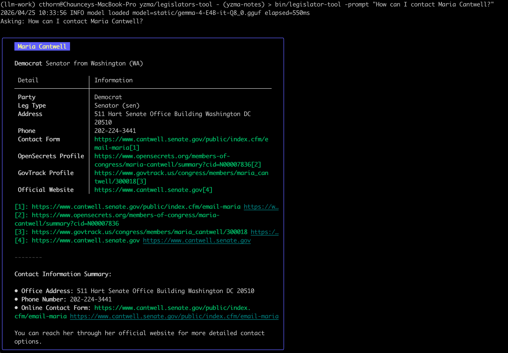

# legislator-tool

Inspire by reading this [article](https://medium.com/@vladimirvivien/building-gemma-4-local-powered-llm-apps-with-go-and-yzma-6bc43d48ee4e) 

Code derived from [yzma-intro](https://github.com/vladimirvivien/llm-go/tree/main/yzma-intro).

## Setting update data for this PoC

- Downloaded: Currently serving Members of Congress ([csv](https://unitedstates.github.io/congress-legislators/legislators-current.csv)) from here https://github.com/unitedstates/congress-legislators

```
sqlite3 legislators.db
.mode csv
.import legislators-current.csv legislators
.import legislators-district-offices.csv legislators_district_offices
.import committee-membership-current.csv legislators_committee_membership

.quit

sqlite3 legislators ".schema --indent"
```

## Learn
Build Go application that use LLM without requiring an API endpoint.

## dependency

llama.cpp release `b8766`

## Usage

```
make build
bin/legislator-tool -prompt "How can I contact Maria Cantwell?"
```


